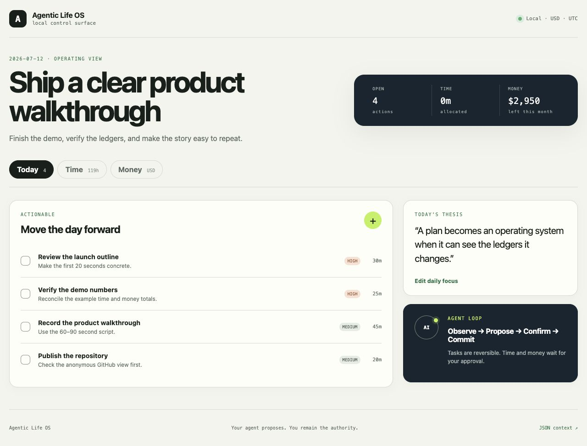

# Agentic Life OS

**A local-first personal operating system where an AI agent helps you allocate
your two scarcest resources: time and money.**



Most personal productivity tools keep tasks, calendars, and budgets in
separate silos. Agentic Life OS gives an agent one small, explicit operating
surface:

- **Today** — one daily focus and a ranked list of actionable work.
- **Time** — a 168-hour weekly budget compared with actual time allocation.
- **Money** — accounts, monthly plans, and actual transactions.

The app contains no model and stores no AI credentials. Bring Codex, Claude,
OpenClaw, or any other agent that can call a local HTTP API or command-line
tool. Your data stays in a local SQLite database.

## Quick start

```bash
git clone https://github.com/qilinxiaoxiang/agentic-life-os.git
cd agentic-life-os
docker compose up --build
```

Open [http://127.0.0.1:5050](http://127.0.0.1:5050). The default container
starts with synthetic demo data in USD. To start clean, copy `.env.example` to
`.env` and set `LIFEOS_DEMO=0`. Set `LIFEOS_CURRENCY` to another ISO 4217 code
before the first run if USD is not your primary currency.

### Local Python setup

```bash
python3.12 -m venv .venv
.venv/bin/pip install -e '.[dev]'
LIFEOS_DB_PATH=./data/lifeos.sqlite LIFEOS_DEMO=1 .venv/bin/python -m agentic_life_os
```

## How AI agents use it

The operating loop is deliberately small:

1. **Observe** — read `/api/v1/context/today` for the current focus, open
   actions, and the live time/money summaries.
2. **Propose** — update reversible tasks directly, but send money and time
   entries to a preview endpoint.
3. **Confirm** — show the normalized preview to the user. Unconfirmed proposals
   do not affect any balance or budget.
4. **Commit** — after explicit approval, commit the proposal atomically.

### Codex example

From this repository, ask Codex:

> Read AGENTS.md and the current Life OS context. Turn my notes into today's
> focus and actionable tasks. Then prepare, but do not commit, the time and
> money I report. Show me the normalized proposal first.

The CLI gives agents a model-independent interface:

```bash
lifeos context
lifeos task add "Review the launch outline" --priority high --minutes 30
lifeos focus set "Ship a clear product walkthrough" --brief "Finish the demo, verify the numbers, publish."
lifeos money overview
lifeos money preview examples/money-batch.json
lifeos money commit <proposal-id>
lifeos time overview
lifeos time preview examples/time-batch.json
lifeos time commit <proposal-id>
```

All commands print JSON. The same operations are documented in
[`openapi.yaml`](openapi.yaml) and the [agent guide](docs/agent-guide.md).

### Useful prompts

- **Initialize budgets:** “Create a realistic monthly money plan and a
  168-hour weekly time budget. Ask about unknown amounts instead of guessing.”
- **Plan Today:** “Read today's context, choose one focus, and turn my notes
  into concrete actionables without deleting existing work.”
- **Evening reconciliation:** “Prepare time and money proposals from my raw
  notes. Preserve my wording and wait for confirmation before commit.”
- **Add a currency:** “Change the empty installation's primary currency to EUR.
  Do not convert existing amounts or blend currencies.”

## Data semantics

Money is stored in integer minor units. Expense, income, refund, and transfer
have distinct balance effects; transfers never count as spending or income.
Every agent-written ledger line can carry a stable `external_id`, so retries
are idempotent.

Time maintains two totals. `clock_minutes` answers where physical time went
and may not exceed 24 hours per day. `allocation_minutes` answers which budgets
that time advanced, so deliberate overlap can be larger than clock time.

The schema includes a currency code on financial rows so another currency can
be added without a migration. Version 1 displays each currency separately and
does not provide exchange rates or cross-currency totals.

## Privacy and security

- The server binds to localhost by default and has no public hosting mode.
- No bank, calendar, model, or third-party account is connected.
- Runtime databases and `.env` files are ignored by Git.
- CI runs tests, linting, a repository privacy denylist, and secret scanning.
- Money and time require preview plus explicit commit; tasks remain directly
  editable because they are easy to reverse.

This is a personal planning ledger, not financial, medical, or legal advice.

## Development

```bash
.venv/bin/pytest
.venv/bin/ruff check .
.venv/bin/python scripts/privacy_check.py
```

The project intentionally stops at Today, Time, and Money. Reports, journals,
habits, health metrics, investment analysis, bank sync, and external
automations belong in optional integrations rather than the core.

## License

MIT
